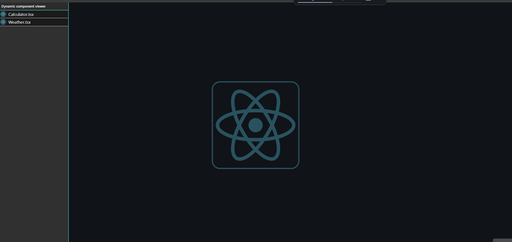

# dynamic-viewer-component
⚡Dynamic Component Viewer built with React, TypeScript and Vite that can quickly switch between components
## ❗Important 
 It's only development tool! It shouldn't be used in production mode because Vite probably will not find your files (components) in folder. Vite glob only works in development mode.
## Used technologies
✅ React
✅ Vite
✅ Typescript
## ⚙️Features
 - Dynamic file loading, Vite will quickly find your new file and inject into viewer.
 - Modern example apps like weather app and calculator. Weather use real api which require your own API_KEY to fetch specified city.
 - Easy to maintain and scalable for future
## 🛠️How to use?
 1. Clone repository
 2. Run `npm install`
 3. Create `.env` file in root folder with your Visual Crossing API key: VITE_WEATHER_API_KEY=your_api_key_here
 4. Run `npm run dev`
## 

